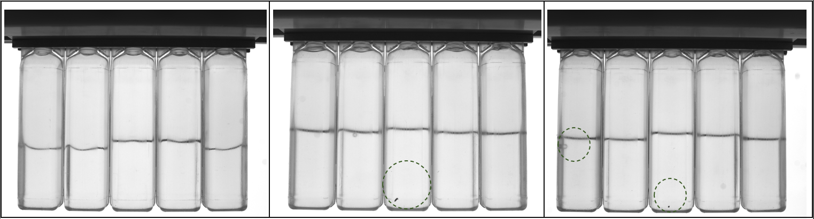
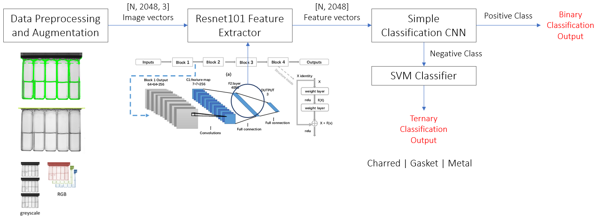
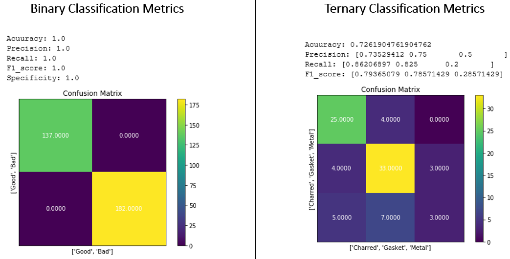

# Industrial Error Detection with Machine Learning Hackathon

PionierGarage | Entrepreneurs. KIT

### 2nd Place Winner

The challenge is to find an efficient and exact process for error detection in the production line.
You will get real data of a manufacturing defect of an operational manufacturing with the aim to classify it in the team binary (good / bad).
The current approach is a visual inspection of the products by a camera. This procedure, as well as the final processing (deep learning / feature extraction / ...) is up to you as a participant!

## Proposed Architecture

## Performance Metrics

